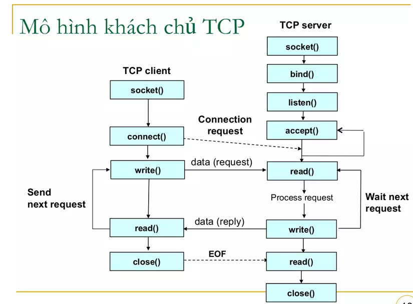

## Usage

### 1. Run server

`./serv <port of your choice>`

### 2. Run client

`./clnt <IP> <same port as above>`

## Build instruction

`make`

## Server and client model

## Demo
https://github.com/newball2814/system-programming/assets/35733326/e48f68fe-0e32-41a5-813f-d09c88cd40c9

## TODO
- [X] Implement multi-thread
